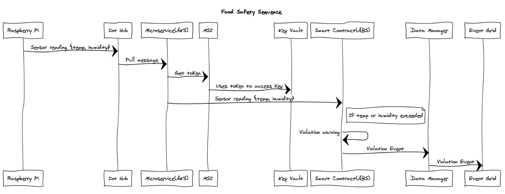
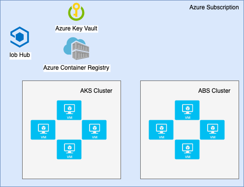

Food Safety Consortium Sample
==================================

# Scenario
The repository contains and end-to-end food safety scenario that uses Azure Blockchain Service and Azure IoT Hub.  It provides a reference architecture for a multi-party consortium using Blockchain as a shared, distributed ledger for tracking the lifecycle of food.  Temperature and humidity sensors are used on top of Raspberry Pi to capture the current state.

An overall high-level call sequence of the solution is as follows:


A view of the overall services that make up the solution architecture are as follows:



# Client Python Dependencies for Raspberry Pi
The client code makes use of the Adafruit_Python_DHT Python module.  You can find the code repository at https://github.com/adafruit/Adafruit_Python_DHT.

Installing
----------

### Dependencies

For all platforms (Raspberry Pi and Beaglebone Black) make sure your system is
able to compile and download Python extensions with **pip**:

On Raspbian or Beaglebone Black's Debian/Ubuntu image you can ensure your
system is ready by running one or two of the following sets of commands:

Python 2:

````sh
sudo apt-get update
sudo apt-get install python-pip
sudo python -m pip install --upgrade pip setuptools wheel
````

Python 3:

````sh
sudo apt-get update
sudo apt-get install python3-pip
sudo python3 -m pip install --upgrade pip setuptools wheel
````

### Install with pip

Use `pip` to install from PyPI.

Python 2:

```sh
sudo pip install Adafruit_DHT
```

Python 3:

```sh
sudo pip3 install Adafruit_DHT
```

# Client nodeJS Dependencies for Raspberry Pi
The nodeJS client code makes use of the node-dht-sensor module.  You can find the code repository at https://github.com/momenso/node-dht-sensor.

Installing
----------

### Dependencies

For all platforms (Raspberry Pi and Beaglebone Black) make sure your system has nodeJS and npm installed. 

On Raspbian or Beaglebone Black's Debian/Ubuntu image you can ensure your
system is ready by following the steps:
Find the ARM version of your pi: 
````sh
uname -a
````

Download the respective version of [nodeJS](https://nodejs.org/en/download/) and install:
````sh
wget <https://nodejs.org/dist/v8.11.3/node-v8.11.3-linux-armv7l.tar.gz>
tar -xzf <node-v8.9.0-linux-armv6l.tar.gz>
cd <node-v6.11.1-linux-armv6l>/
sudo cp -R * /usr/local/
````

Verify the node and npm version using the following commands:
````sh
node -v
npm -v
````

Install the sensor module:

````sh
npm install node-dht-sensor
````

Install git and Azure IoT module:

````sh
sudo apt-get install git
npm install azure-iot-device
npm install azure-iot-device-mqtt
````
# Azure Blockchain Service

All Quorum smart contracts will be deployed to Azure Blockchain Service. The smart contracts will store a history of the temperature and humidity snapshots from all counterparties, and will use the Azure Blockchain Service Data Manager Gateway to send violation notifications to Event Grid. Subscribers will be able to take appropriate action at the time of violation and all violations will be logged to the ledger for audit purposes.

# Microservices


