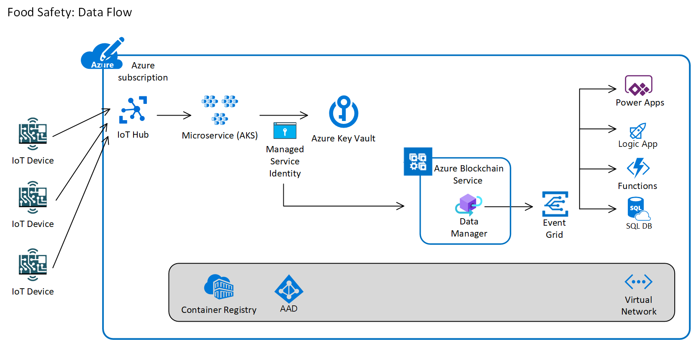

Food Safety Consortium Sample
==================================

# Scenario
The repository contains and end-to-end food safety scenario that uses Azure Blockchain Service and Azure IoT Hub.  It provides a reference architecture for a multi-party consortium using Blockchain as a shared, distributed ledger for tracking the lifecycle of food.  Temperature and humidity sensors are used on top of Raspberry Pi to capture the current state.

An overall high-level call sequence of the solution is as follows:


A view of the overall services that make up the solution architecture are as follows:



# Client Python Dependencies for Raspberry Pi
The client code makes use of the Adafruit_Python_DHT Python module.  You can find the code repository at https://github.com/adafruit/Adafruit_Python_DHT.

Installing
----------

### Dependencies

For all platforms (Raspberry Pi and Beaglebone Black) make sure your system is
able to compile and download Python extensions with **pip**:

On Raspbian or Beaglebone Black's Debian/Ubuntu image you can ensure your
system is ready by running one or two of the following sets of commands:

Python 2:

````sh
sudo apt-get update
sudo apt-get install python-pip
sudo python -m pip install --upgrade pip setuptools wheel
````

Python 3:

````sh
sudo apt-get update
sudo apt-get install python3-pip
sudo python3 -m pip install --upgrade pip setuptools wheel
````

### Install with pip

Use `pip` to install from PyPI.

Python 2:

```sh
sudo pip install Adafruit_DHT
```

Python 3:

```sh
sudo pip3 install Adafruit_DHT
```

# Client nodeJS Dependencies for Raspberry Pi
The nodeJS client code makes use of the node-dht-sensor module.  You can find the code repository at https://github.com/momenso/node-dht-sensor.

Installing
----------

### Dependencies

For all platforms (Raspberry Pi and Beaglebone Black) make sure your system has nodeJS and npm installed. 

On Raspbian or Beaglebone Black's Debian/Ubuntu image you can ensure your
system is ready by following the steps:
Find the ARM version of your pi: 
````sh
uname -a
````

Download the respective version of [nodeJS](https://nodejs.org/en/download/) and install:
````sh
wget <https://nodejs.org/dist/v8.11.3/node-v8.11.3-linux-armv7l.tar.gz>
tar -xzf <node-v8.9.0-linux-armv6l.tar.gz>
cd <node-v6.11.1-linux-armv6l>/
sudo cp -R * /usr/local/
````

Verify the node and npm version using the following commands:
````sh
node -v
npm -v
````

Install the sensor module:

````sh
npm install node-dht-sensor
````

Install git and Azure IoT module:

````sh
sudo apt-get install git
npm install azure-iot-device
npm install azure-iot-device-mqtt
````

# Azure Blockchain Service

All Quorum smart contracts will be deployed to Azure Blockchain Service. The smart contracts will store a history of the temperature and humidity snapshots from all counterparties, and will use the Azure Blockchain Service Data Manager Gateway to send violation notifications to Event Grid. Subscribers will be able to take appropriate action at the time of violation and all violations will be logged to the ledger for audit purposes.

# Microservices 

The solution will be build with REST microservices that encapsulate all communication with the Blockchain ledger. This allows external callers to use simple SDKs to make REST calls without bringing any Blockchain code into thier solution. The core microservice will be written in .NET using the Nethereum Nuget package, which handles all of the RPC communication with Blockchain.

A second microservice will handle the injestion from the IoT devices through the Azure IoT Hub. The rate of message delivery (temperature/humidity) will exceed the rate at which the Blockchain ledger can produce transactions, so a microservice will be used to read from the IoT Hub and batch up writes to the smart contract.

# Key Vault

All Blockchain transactions will be signed by private keys stored and managed in Azure Key Vault. Blockchain keys are typically stored in wallet software, but some consortium members want a single account (public/private key pair) to represent the organization. The HSM capabilities of Azure Key Vault are great for storing these organization's keys as it is backed by an SLA can be guarded by RBAC. All keys required in Blockchain transactions will be stored in Key Vault for this sample.

# Azure Kubernetes Service (AKS)

Azure Blockchain DevKit is a tremendous framework for working with Azure Blockchain Service with serverless technologies. It is overs developers the opportunity to simply leverage things like Logic Apps connectors to abstract away interacting with the Blockchain ledger. However, many organizations have made significant investments in Kubernetes clusters in support of cloud native architectures. This sample shows how you can use cloud native microservices on Kubernetes to abstract away Blockchain.


All microservices will be deployed to Azure Kubernetes Service. The AKS pods will be given managed service identity through the AAD Pod Identity package. This will allow the microservice reposible for writing to the Azure Blockchain Service to retrive the key from the Azure Key Vault without needing any service principal credentials. The only configuration information needed to interact with the needed keys will be the URI of the keys in Key Vault.

# Event Grid 

The Azure Blockchain Service's Data Manager will publish messages to an Azure Event Grid. Will enable subscribers to to respond to events that are triggered from transactions to the Blockchain ledger. This enables integration scenarios while allowing the Blockchain ledger to be the single source of truth. A number of integration services such as Logic Apps, Azure Functions and Power Apps can capture the event and take appropriate action based on the unique requirements of the counterpart member.

# Azure SQL Database

Blockchain ledgers are not designed for querying. Organizations that want to query the data that lives in Blockchain will usually execute queries against an offchain store like a SQL Database. Using the Azure Blockchain Service Data Manager allows events to be captured from Event Grid and written to an external offchain store. This sample includes an Azure SQL Database to store a replica of the data in the Blockchain ledger. Traditional querying and analytics tools can be used to interact with the data in Azure SQL Database.